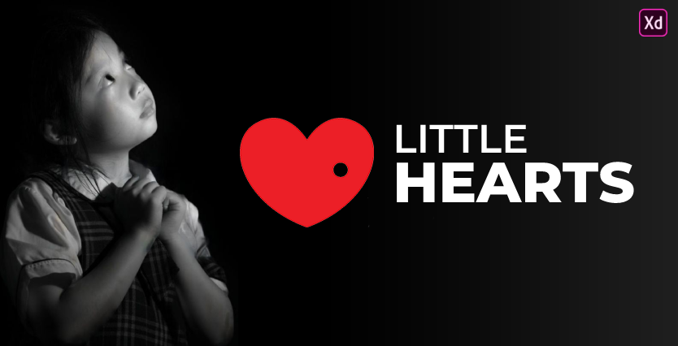

## Little Hearts

## Table of Contents

- [Introduction](#introduction)
- [Features](#features)
- [Build Process](#build-process)
- [Tech Stack](#tech-stack)

 

## Introduction

This is a decentralized Little Hearts redesign and development project that can create donation events and also donate events using ethereum using your metamask wallet.

## Features

A few of the things you can do with Netflix 2.0:

🚀 Donate using ethereum  
🚀 Authentication using Metamask  
🚀 Add Donation Event  
🚀 View Top Donators

## Build Process

- Clone or download the repo
- `yarn` to install dependencies
- `yarn dev` to run the application

## Tech Stack

    
    
    
    
    
    
    
    
    

## Project Goals & Outcomes

✔️ Learning Truffle, Ganache & Metamask Authentication  
✔️ Testing contracts using chai  
✔️ Learning Framer Motion Animations  
✔️ Learning Tailwind CSS